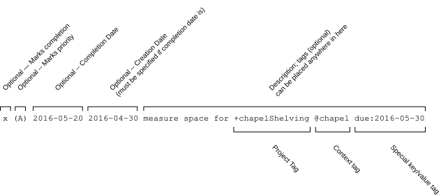

# Todo Txt

A Windows desktop application for managing one-time tasks in a shared `todo.txt` file.

Tasks have a title, due date, optional notes, priority, and a completion state. Completing a task marks it finished — it does not create or schedule another occurrence.

## Download

Get the latest build from the [Releases page](https://github.com/PlainTxtOffice/todo.txt/releases/latest), or download [todo_txt_portable.exe](https://github.com/PlainTxtOffice/todo.txt/releases/download/v1.0.0/todo_txt_portable.exe) (v1.0.0, 23 MB) directly.

The build is self-contained and portable — no installer, and **no Python installation required**. Download it and run it.

Put it in a folder you can write to. The application stores its settings and logs beside the executable, so a protected location such as `C:\Program Files\` will stop settings from saving. A folder under Documents, your Desktop, or a USB drive works.

SHA-256 for v1.0.0:

```
43eb7aa814162d1059c4fe1292e7569ce98e31044ef1ecc82ca0cdefd1402941
```

Verify your download with:

```powershell
Get-FileHash .\todo_txt_portable.exe -Algorithm SHA256
```

### SmartScreen warning

The executable is not code-signed, so Windows SmartScreen will likely warn you on first run. Click **More info** → **Run anyway**. Comparing the SHA-256 above against your downloaded copy confirms you have the file that was published here.

## Source Code

This repository hosts the released executable. The full source for each release is distributed as a `.zip` archive from the [PlainTxtOffice Source Code page](https://plaintxtoffice.com/source-code/).

Building from source requires Python 3.12 or later and PySide6 6.8 or later. With the archive extracted and a virtual environment created:

```powershell
.venv/Scripts/python.exe -m src.main
```

```powershell
.venv/Scripts/python.exe -m pytest
```

## Task Format

Each task is a single line. The diagram below shows what each part means:



## Storage and Configuration

The configured `todo.txt` file is the single source of truth. Set its location under **Edit → Settings**; changing it takes effect after restarting the app.

The application is designed around a file kept in a synced folder such as Dropbox, so it guards against the ways those files get clobbered:

- tasks are tracked by stable `id:` metadata that survives rewrites
- a save is rejected when another application has changed the file since it was read, with the option to reload instead of overwriting
- Dropbox conflicted copies found beside the configured file are reported at startup

## Documentation

- [User Manual](USER_MANUAL.md) — how to use the application.
- [Format Specification](todo_spec.md) — the `todo.txt` format in detail.

## Glossary

- **todo.txt** — a plain-text task format with one task per line.
- **Due date** — the date by which a task should be completed, stored as `due:YYYY-MM-DD`.
- **Project** — a token beginning with `+`, such as `+Home`.
- **Context** — a token beginning with `@`, such as `@phone`.
- **Priority** — an uppercase `A` through `Z` value shown as `(A)`.

## License

Released under the [GNU General Public License v3.0](LICENSE).
